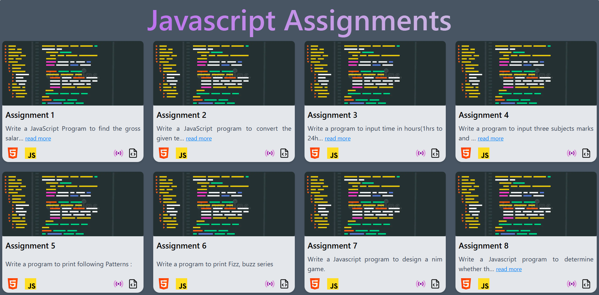

# 📦 JavaScript Assignments

This project contains practical JavaScript-based assignments focused on adding interactivity and logic to web pages. These projects help reinforce core programming concepts like:

🧠 DOM manipulation

🕹️ Event handling

⏱️ Timers and intervals

🧮 Form validation and calculations

🔁 Loops, conditions, and data handling

🗂️ Modular code structure

💡 Real-world mini-applications

Each assignment demonstrates how JavaScript enhances user experience by making web pages dynamic and responsive

## 🖼️ UI Overview

## 🛠️ Tech Stack

- **HTML**
- **CSS**
- **JAVASCRIPT**

## 🚀 Live Demo

## 📄 License

MIT License

Copyright (c) 2025 Tejas

Open source under the 
